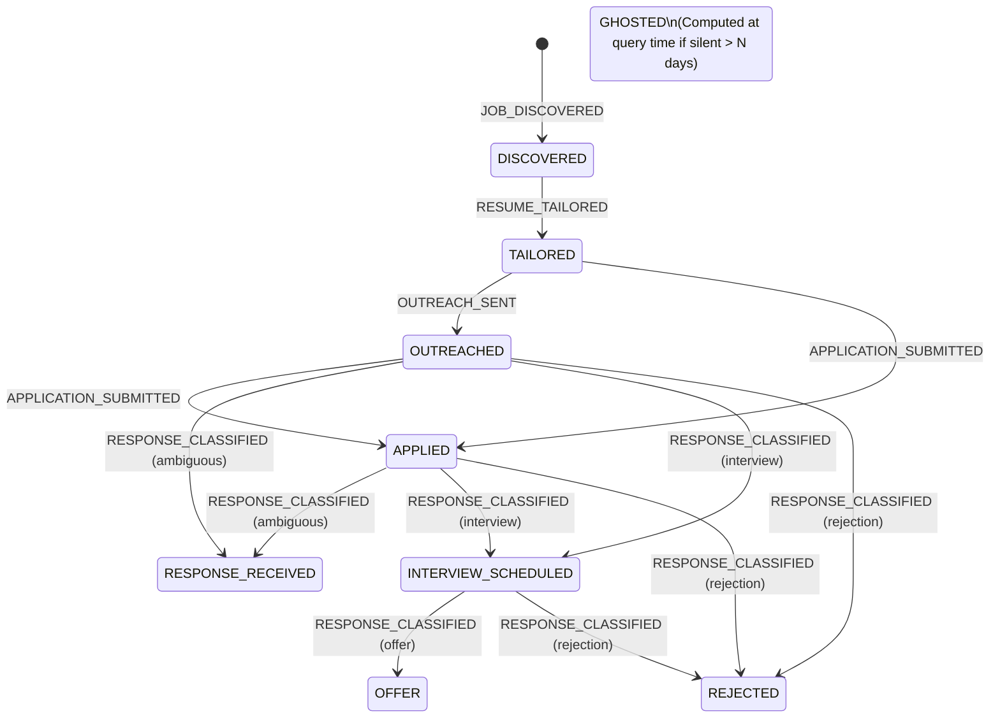

# CONDUCTOR [8] — Memory Module

[](https://www.python.org/downloads/)
[]()
[]()
[]()

> **Durable, append-only, cross-component state ledger and interaction history for the CONDUCTOR autonomous job-search pipeline.**

---

## 📌 Overview

The **Memory Module** is Component #8 (Learning Layer) in the **CONDUCTOR** ecosystem. It provides a single source of truth for the candidate's entire job search lifecycle—from job discovery, resume tailoring, and outreach through recruiter sentiment classification and final offer/rejection outcomes.

```
DATA LAYER
 [10] Candidate Profile JSON ─────────────────────────┐
                                                      │ (read by opaque ID)
DISCOVERY                                            │
 [1]  The Harvester ──────► JOB_DISCOVERED            │
                                                      │
APPLICATION                                           │
 [2]  AlignResume ────────► RESUME_TAILORED           │
 [3]  Overture ───────────► OUTREACH_SENT             │
 [7]  PDF Auto-Apply ─────► APPLICATION_SUBMITTED     │
                                                      │
LEARNING                                              │
 [9]  Sentiment Classifier ► RESPONSE_CLASSIFIED      │
                                   │                  │
                                   ▼                  │
                     ┌──────────────────────────┐     │
                     │   [8] MEMORY MODULE       │◄────┘
                     │   • Append-only event log │
                     │   • Materialized state    │
                     │   • Full audit trail      │
                     └─────────────┬────────────┘
                                   │ queried by
                                   ▼
COORDINATION
 [6]  Conductor Orchestrator / CLI Harness
```

### Core Design Principles
1. **Pure Sink-and-Source:** Remembers and reports state; never originates actions or makes orchestration decisions (reserved for Conductor).
2. **100% Deterministic:** Zero LLM or embedding calls in the critical ingestion/query path.
3. **Loss-Free Fallbacks:** Malformed or unrecognized payloads are recorded as immutable `UNKNOWN` events rather than raising exceptions or dropping data.
4. **Hybrid Event Sourcing (ADR-4):** `memory_events` is the immutable source of truth; `application_records` and `status_transitions` are materialized views that can be rebuilt deterministically via `rebuild_derived_state()`.
5. **Idempotency (ADR-5):** Deduplication by deterministic `event_id` prevents duplicate writes on producer retries.

---

## 🔄 State Machine Lifecycle



* **Soft-Terminal States:** `REJECTED`, `OFFER`, and `WITHDRAWN` can only be overridden via explicit `MANUAL_NOTE` events.
* **Computed States:** `GHOSTED` is calculated on-demand (e.g., applications awaiting response that have been silent for $\ge N$ days).

---

## 🛠️ Project Structure

```
.
├── docs/                               # Formal Specification Suite (v1.0)
│   ├── Memory_Module_00_Master_Index_v1.0.md
│   ├── Memory_Module_01_Problem_Statement_v1.0.md
│   ├── Memory_Module_02_Mission_Plan_v1.0.md
│   ├── Memory_Module_03_Architecture_Design_v1.0.md
│   ├── Memory_Module_04_Implementation_Plan_v1.0.md
│   ├── Memory_Module_05_Evaluation_Plan_v1.0.md
│   └── Memory_Module_06_Edge_Case_Plan_v1.0.md
├── src/
│   ├── models.py                       # Pydantic v2 domain models & Enums
│   ├── db.py                           # SQLite schema DDL, indexing, CRUD helpers
│   ├── state_machine.py                # Pure transition logic apply_event()
│   ├── store.py                        # In-process MemoryStore (Record & Query API)
│   └── adapters.py                     # Upstream producer ingestion adapters
├── tests/
│   ├── test_db.py                      # DB round-trip and constraint tests
│   ├── test_state_machine.py           # 100% coverage of transition table
│   ├── test_ingestion.py               # Ingestion idempotency & lifecycle integration
│   ├── test_query_and_rebuild.py       # Query API & Gate G5 Rebuild Equivalence
│   └── test_cli.py                     # CLI subprocess integration tests
├── memory_cli.py                       # Standalone CLI Harness for manual inspection
├── requirements.txt                    # Minimal dependencies (pydantic>=2, pytest>=7)
└── README.md
```

---

## 🚀 Getting Started

### 1. Installation
```bash
# Clone the repository
git clone https://github.com/sdn9300/conductor-memory-module.git
cd conductor-memory-module

# Install dependencies
pip install -r requirements.txt
```

### 2. Running Tests
```bash
python -m pytest
```

---

## 💻 Python API Usage

```python
from datetime import datetime, timezone
from src.store import MemoryStore
from src.adapters import from_harvester_event, from_classified_signal

# Initialize store
store = MemoryStore("memory.db")

# Ingest event from Harvester
event = from_harvester_event({
    "job_id": "job_google_001",
    "application_id": "app_001",
    "company": "Google",
    "role": "Software Engineer",
    "occurred_at": datetime.now(timezone.utc).isoformat()
})
store.record_event(event)

# Ingest classified sentiment response
signal_event = from_classified_signal({
    "response_id": "resp_999",
    "application_id": "app_001",
    "company": "Google",
    "role": "Software Engineer",
    "intent_label": "interview_invite",
    "macro_sentiment": "positive",
    "urgency_score": 5,
    "confidence": 0.98,
    "recommended_action": "Schedule phone screen",
    "classified_at": datetime.now(timezone.utc).isoformat()
})
store.record_event(signal_event)

# Query current state
app = store.get_application("app_001")
print(app.status)  # ApplicationStatus.INTERVIEW_SCHEDULED

# Rebuild derived state from raw event logs (ADR-4)
store.rebuild_derived_state()
```

---

## 🖥️ CLI Harness

The repository includes a self-contained CLI (`memory_cli.py`) for inspection and local dogfooding:

```bash
# Record an event manually
python memory_cli.py record -a app_001 -t job_discovered -c "Anthropic" -r "Research Engineer"

# View current application status
python memory_cli.py status app_001

# List all active applications
python memory_cli.py list

# Find applications silent for >= 7 days
python memory_cli.py stale --days 7

# Inspect chronological event trail
python memory_cli.py history app_001

# Reconstitute derived tables from raw event history
python memory_cli.py rebuild
```

---

## 📄 License & Attribution

Part of the **CONDUCTOR** Autonomous Job-Search Pipeline ecosystem.
Authored by [Soumyadeep Nath](https://github.com/sdn9300).
