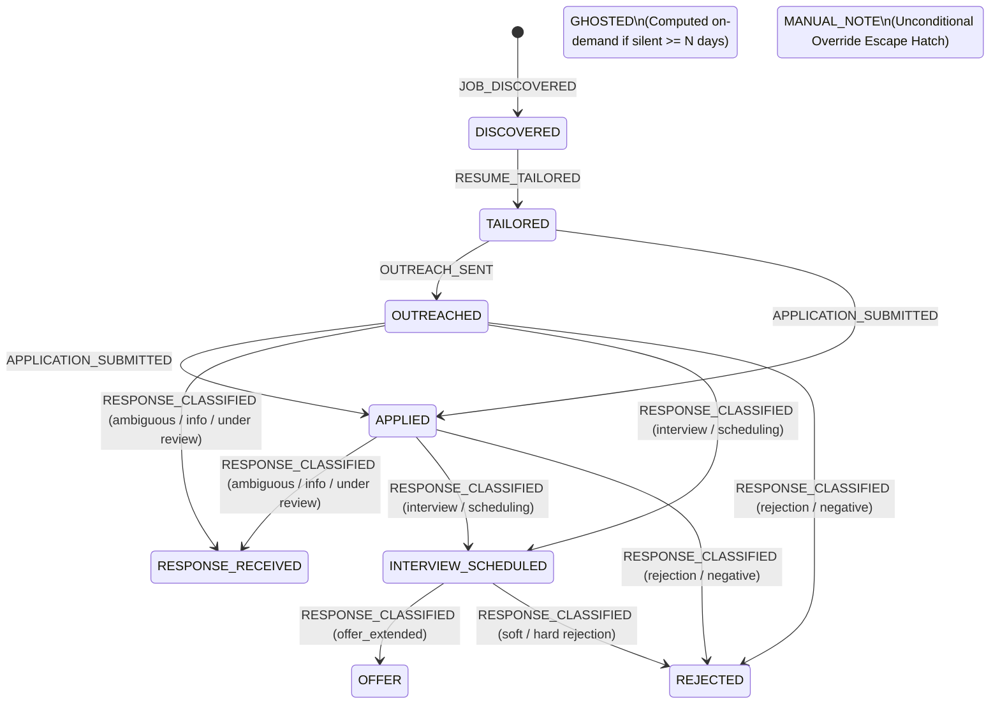

# CONDUCTOR [8] — Memory Module: Comprehensive System Architecture & Engineering Reference Report

**Component:** CONDUCTOR Component #8 · Learning Layer  
**Repository:** [`sdn9300/conductor-memory-module`](https://github.com/sdn9300/conductor-memory-module)  
**Author:** Soumyadeep Nath  
**Status:** Implementation Complete (v1.0.0 — Phases 0–4 Shipped, 18/18 Tests Passing)  
**Date:** August 2026  

---

## 1. Executive Summary & System Positioning

In an autonomous multi-agent pipeline like **CONDUCTOR** (a 10-component job application system), agentic nodes independently discover jobs, tailor resumes, send outreach emails, and classify recruiter replies. Without a unified, durable memory layer, two critical system failures inevitably emerge:
1. **State Fragmentation & Amnesia:** Components operate in isolation with private ephemeral stores or discarded signals, preventing the orchestrator from knowing what actually happened across the end-to-end pipeline.
2. **Orchestration Failure:** Downstream routing decisions (*"Should we follow up?", "Did this company reject the candidate?", "Has a tailored resume already been produced for this job ID?"*) are forced to rely on noisy ad-hoc heuristics or fragile scraping of disjointed logs.

The **Memory Module** solves this by acting as the **single source of truth and durable interaction ledger** for the entire job search lifecycle.

```
DATA LAYER
 [10] Candidate Profile JSON ─────────────────────────┐
      (Static candidate identity ground truth)        │ (opaque ID link)
                                                      │
DISCOVERY                                            │
 [1]  The Gleaner ──────► JOB_DISCOVERED            │
                                                      │
APPLICATION                                           │
 [2]  AlignResume ────────► RESUME_TAILORED           │
 [3]  Overture ───────────► OUTREACH_SENT             │
 [7]  PDF Auto-Apply ─────► APPLICATION_SUBMITTED     │
                                                      │
LEARNING                                              │
 [9]  Sentiment Classifier ► RESPONSE_CLASSIFIED      │
                                   │                  │
                                   ▼                  │
                     ┌──────────────────────────┐     │
                     │   [8] MEMORY MODULE       │◄────┘
                     │   • Append-only event log │
                     │   • Materialized state    │
                     │   • Full audit history    │
                     └─────────────┬────────────┘
                                   │ queried by
                                   ▼
COORDINATION
 [6]  Conductor Orchestrator / Standalone CLI Harness
```

### Core Engineering Invariants
* **"Remember; Do Not Decide":** The Memory Module calculates derived *state* (what is true right now) but never derives *action* (what should happen next). Actions remain strictly within the domain of the Conductor Orchestrator (#6).
* **Deterministic Core (Zero LLM/Embedding Overhead):** Ingestion and query paths are 100% deterministic, requiring zero LLM calls, zero network round-trips, and zero API costs.
* **Loss-Free Fallbacks:** Unrecognized or malformed inputs are safely parsed into `UNKNOWN` fallback events in the append-only ledger—no data is ever silently dropped.
* **Hybrid Event Sourcing (ADR-4):** Historical auditability is guaranteed via immutable raw events, while fast sub-millisecond querying is powered by materialized state views that can be completely re-derived on demand.

---

## 2. Architecture & Data Engineering Topology

### 2.1 Storage Architecture & Schema Design (ADR-1 & ADR-4)

The database engine is built on **SQLite 3** (`memory.db`), utilizing relational indexing and foreign key integrity.

```
                    Upstream Producers (Adapters)
                                  │
                                  ▼
               ┌─────────────────────────────────────┐
               │        memory_events (Table)        │  ◄── Immutable Append-Only Ledger
               │    (Raw JSON payloads, UUID keys)   │
               └──────────────────┬──────────────────┘
                                  │
                        Deterministic Replay
                       (`src/state_machine.py`)
                                  │
                                  ▼
               ┌─────────────────────────────────────┐
               │     application_records (Table)     │  ◄── Materialized Current State
               │      status_transitions (Table)     │  ◄── Audit Trail of State Jumps
               └─────────────────────────────────────┘
```

#### Database Schema (`src/db.py`)
```sql
-- 1. Immutable Event Ledger
CREATE TABLE memory_events (
    event_id          TEXT PRIMARY KEY,
    event_type        TEXT NOT NULL,
    source_component  TEXT NOT NULL,
    application_id    TEXT,
    job_id            TEXT,
    occurred_at       TEXT NOT NULL,
    ingested_at       TEXT NOT NULL,
    payload_json      TEXT NOT NULL,
    raw_source_ref    TEXT
);

-- 2. Materialized Application State (Query View)
CREATE TABLE application_records (
    application_id  TEXT PRIMARY KEY,
    job_id          TEXT NOT NULL,
    company         TEXT NOT NULL,
    role_title      TEXT NOT NULL,
    status          TEXT NOT NULL,
    created_at      TEXT NOT NULL,
    last_updated    TEXT NOT NULL
);

-- 3. State Jump Audit Log
CREATE TABLE status_transitions (
    id                  INTEGER PRIMARY KEY AUTOINCREMENT,
    application_id      TEXT NOT NULL,
    from_status         TEXT,
    to_status           TEXT NOT NULL,
    transitioned_at     TEXT NOT NULL,
    triggering_event_id TEXT NOT NULL,
    FOREIGN KEY (application_id) REFERENCES application_records(application_id),
    FOREIGN KEY (triggering_event_id) REFERENCES memory_events(event_id)
);

CREATE INDEX idx_events_application ON memory_events(application_id);
CREATE INDEX idx_events_type        ON memory_events(event_type);
CREATE INDEX idx_transitions_app    ON status_transitions(application_id);
```

---

## 3. Formal State Machine & Application Lifecycle

### 3.1 State Transition Graph



### 3.2 Transition Rules Matrix (`src/state_machine.py`)

| Initial Status (`from_status`) | Incoming Trigger Event | Derived Target Status (`to_status`) | Engineering Notes |
|---|---|---|---|
| *None* | `JOB_DISCOVERED` | `DISCOVERED` | Initializes the `ApplicationRecord`. |
| `DISCOVERED` | `RESUME_TAILORED` | `TAILORED` | Triggered by AlignResume (#2) `TailoringRun`. |
| `TAILORED` | `OUTREACH_SENT` | `OUTREACHED` | Cold outreach dispatched via Overture (#3). |
| `TAILORED` / `OUTREACHED` | `APPLICATION_SUBMITTED` | `APPLIED` | Direct job board submission (e.g. PDF Auto-Apply #7). |
| `APPLIED` / `OUTREACHED` / `AWAITING_RESPONSE` | `RESPONSE_CLASSIFIED` (`interview_invite`, `scheduling_link`) | `INTERVIEW_SCHEDULED` | Positive signal extracted by Sentiment Classifier (#9). |
| `APPLIED` / `OUTREACHED` / `INTERVIEW_SCHEDULED` | `RESPONSE_CLASSIFIED` (`soft_rejection`, `hard_rejection`, or `macro_sentiment="negative"`) | `REJECTED` | Post-interview rejections transition cleanly without error. |
| `APPLIED` / `OUTREACHED` | `RESPONSE_CLASSIFIED` (`request_for_info`, `under_review`, `follow_up_needed`, `unclear`, `auto_reply`, `referral_signal`) | `RESPONSE_RECEIVED` | Held for candidate or orchestrator attention. |
| `INTERVIEW_SCHEDULED` | `RESPONSE_CLASSIFIED` (`offer_extended`) | `OFFER` | Positive milestone outcome. |
| *Any State* | `MANUAL_NOTE` (with `status_override`) | *Specified Override Status* | Explicit human-in-the-loop override mechanism. |
| *Soft-Terminal* (`REJECTED`, `OFFER`, `WITHDRAWN`) | *Any automated event* | *Unchanged* | Soft-terminal protection: automated events cannot overwrite closed states. |
| *Any State* | `UNKNOWN` event | *Unchanged* | Payload safely preserved in ledger without altering derived status. |
| *In-Progress State* | `get_stale_applications(days_silent=N)` | `GHOSTED` (Computed) | Evaluated on read: elapsed silence $\ge N$ days. |

### 3.3 Defense Against Upstream Model Miscalibration (EC-AMBIG-010)
Sentiment Classifier v1.0.1 historically had an edge-case defect where aggressive recruiter deadline wording in soft rejections inflated urgency scores. 
* **Design Defense:** Memory Module strictly treats `urgency_score` and `recommended_action` as **advisory metadata**, relying on coarse intent categories (`intent_label`, `macro_sentiment`) for state transitions.
* The full raw signal is permanently preserved in `memory_events.payload_json`. If the upstream classifier is retrained or patched, the entire history can be replayed cleanly via `rebuild_derived_state()`.

---

## 4. In-Process Python API & Adapter Catalog

### 4.1 `MemoryStore` API Surface (`src/store.py`)

The primary programmatic interface designed for in-process import by Conductor Orchestrator (#6):

```python
class MemoryStore:
    def __init__(self, db_path: str = "memory.db") -> None:
        """Initializes database helper and verifies schema integrity."""
        ...

    def record_event(self, event: MemoryEvent) -> None:
        """
        Deduplicates event by event_id (ADR-5).
        Appends raw event to memory_events.
        Materializes state update in application_records and status_transitions.
        """
        ...

    def get_application(self, application_id: str) -> Optional[ApplicationRecord]:
        """Fetches current materialized ApplicationRecord and linked event IDs."""
        ...

    def list_applications(self, status: Optional[ApplicationStatus] = None) -> List[ApplicationRecord]:
        """Lists application records, optionally filtered by ApplicationStatus."""
        ...

    def get_history(self, application_id: str) -> List[MemoryEvent]:
        """Retrieves full chronological interaction audit trail for an application."""
        ...

    def get_stale_applications(self, days_silent: int, as_of: Optional[datetime] = None) -> List[ApplicationRecord]:
        """
        Solves Minimum Viable Start query:
        Returns in-progress applications silent for >= days_silent days,
        excluding terminal states (REJECTED, OFFER, WITHDRAWN), sorted by staleness.
        """
        ...

    def rebuild_derived_state(self) -> None:
        """
        Drops and replays derived tables from immutable memory_events (Gate G5).
        Guarantees complete state recovery from raw logs.
        """
        ...
```

### 4.2 Ingestion Adapters (`src/adapters.py`)

Adapters convert upstream component dictionaries and Pydantic models into standardized, validated `MemoryEvent` objects with deterministic SHA-256 `event_id` hashes for deduplication:

1. **`from_harvester_event(data: Dict[str, Any]) -> MemoryEvent`**
   * **Source:** The Gleaner (#1)
   * **Event Type:** `EventType.JOB_DISCOVERED`
   * **Payload Keys:** `job_id`, `company`, `role_title`, `url`, `location`, `salary_estimate`
2. **`from_align_resume_event(data: Dict[str, Any]) -> MemoryEvent`**
   * **Source:** AlignResume (#2)
   * **Event Type:** `EventType.RESUME_TAILORED`
   * **Payload Keys:** `application_id`, `tailoring_run_id`, `match_score`, `tailored_resume_path`
3. **`from_overture_event(data: Dict[str, Any]) -> MemoryEvent`**
   * **Source:** Overture (#3)
   * **Event Type:** `EventType.OUTREACH_SENT`
   * **Payload Keys:** `application_id`, `send_id`, `recipient_email`, `subject`, `channel`
4. **`from_classified_signal(signal: Union[Dict, ClassifiedSignal]) -> MemoryEvent`**
   * **Source:** Sentiment Classifier (#9)
   * **Event Type:** `EventType.RESPONSE_CLASSIFIED`
   * **Payload Keys (Reconciled with v1.0.1):** `response_id`, `application_id`, `company`, `role`, `macro_sentiment`, `intent_label`, `urgency_score`, `confidence`, `recommended_action`, `classified_at`

---

## 5. CLI Harness & Operations Reference (`memory_cli.py`)

A fully standalone command-line harness enables manual dogfooding, pipeline debugging, and administrative state rebuilds without requiring active external orchestrators.

```bash
# 1. Manually record job discovery
python memory_cli.py record -a app_google_01 -t job_discovered -c "Google" -r "AI Platform Engineer" -j job_goog_101

# 2. Record resume tailoring run
python memory_cli.py record -a app_google_01 -t resume_tailored -p '{"tailoring_run_id": "run_999", "match_score": 0.94}'

# 3. Record outreach dispatch
python memory_cli.py record -a app_google_01 -t outreach_sent -p '{"send_id": "outreach_123"}'

# 4. Ingest recruiter sentiment response
python memory_cli.py record -a app_google_01 -t response_classified --intent interview_invite -p '{"macro_sentiment": "positive", "confidence": 0.98}'

# 5. Inspect application status
python memory_cli.py status app_google_01

# 6. Query stale applications awaiting response (>= 7 days silent)
python memory_cli.py stale --days 7

# 7. View chronological audit trail
python memory_cli.py history app_google_01

# 8. Rebuild derived state from raw event logs
python memory_cli.py rebuild
```

---

## 6. Architecture Decision Records (ADRs) Summary

| ADR ID | Decision | Alternative Considered | Rationale & Trade-off Resolution |
|---|---|---|---|
| **ADR-1** | **SQLite Storage Engine** | PostgreSQL, Flat JSON files | Single-user, zero-cost, bundled in Python standard library (`sqlite3`), proven in Overture, provides full ACID transactions and relational indexing without running background server daemons. |
| **ADR-2** | **Structured Ledger vs Vector RAG** | Immediate Qdrant / Vector RAG | The core problem is exact-state tracking, not fuzzy semantic recall. A Qdrant-backed RAG capstone is scheduled for later roadmap phases (DevOps Phase 14 / Stage 03); it will directly ingest this structured ledger. |
| **ADR-3** | **In-Process Python API** | FastAPI / HTTP Microservice | Avoids premature network complexity and port management across local CONDUCTOR nodes. Transport-agnostic design allows wrapping with FastAPI/MCP later in under an hour. |
| **ADR-4** | **Hybrid Event Sourcing** | Single Mutable Table | Single mutable tables lose historical auditability. Event sourcing guarantees complete reconstruction for interview prep and zero-data-loss bug recovery via `rebuild_derived_state()`. |
| **ADR-5** | **Deterministic Idempotency** | Random UUID per request | Upstream producers retry on timeout. Deterministic SHA-256 ID generation (`source:ref:type:timestamp`) ensures repeated event submissions are safe no-ops. |

---

## 7. Edge-Case Matrix & Failure Mitigations (`MEM-EC-1.0`)

The system catalogued 20 concrete failure modes across 6 categories, with 100% test and structural coverage:

```
┌─────────────────────────────────────────────────────────────────────────────┐
│                       EDGE CASE MITIGATION REGISTRY                         │
├────────────────────────────────┬────────────┬───────────────────────────────┤
│ Scenario & Category            │ Severity   │ Engineered Defense Mechanism  │
├────────────────────────────────┼────────────┼───────────────────────────────┤
│ EC-MEM-A01 (Duplicate events)  │ Blocking   │ ADR-5 SHA-256 deduplication   │
│ EC-MEM-A02 (Out-of-order race) │ Blocking   │ Event replay in occurred_at   │
│ EC-MEM-A03 (Malformed payload) │ Blocking   │ Fallback to UNKNOWN event     │
│ EC-MEM-B01 (New producer type) │ Blocking   │ Flexible JSON payload schema  │
│ EC-MEM-C01 (Urgency anomaly)   │ Blocking   │ Advisory score treatment      │
│ EC-MEM-C03 (Rejection reversal)│ Degraded   │ MANUAL_NOTE status override   │
│ EC-MEM-C04 (Ghosted timeout)   │ Blocking   │ Query-time staleness calculus │
│ EC-MEM-D01 (Multi-role disamb) │ Blocking   │ Scoped application_id keying  │
│ EC-MEM-E02 (Write interruption)│ Blocking   │ SQLite ACID transactions      │
│ EC-MEM-F01 (Repository leak)   │ Blocking   │ Structural .gitignore rules   │
└────────────────────────────────┴────────────┴───────────────────────────────┘
```

---

## 8. Quality Assurance & Evaluation Gates (`MEM-EP-1.0`)

### Hard-Blocking Verification Gates (All Passed)
* **Gate G1 (Zero Data Loss):** Every event passed to `record_event()` persists across process restarts and is retrievable via `get_history()`.
* **Gate G2 (Idempotency):** Resubmitting identical `event_id`s produces no duplicates and leaves derived state untouched.
* **Gate G3 (Fallback Coverage):** Malformed/unrecognized payloads are logged as `UNKNOWN` without crashing the ingestion pipeline.
* **Gate G4 (State Machine Correctness):** 100% of defined state machine transitions are validated with unit tests.
* **Gate G5 (Rebuild Equivalence):** Derived state created incrementally matches state re-derived from scratch byte-for-byte.

### Automated Test Suite Summary (`tests/`)
* `test_db.py`: Database roundtrip & foreign key constraints.
* `test_state_machine.py`: 11 transition unit tests.
* `test_ingestion.py`: Ingestion pipeline & idempotency.
* `test_query_and_rebuild.py`: Query methods & Gate G5 equivalence proof.
* `test_cli.py`: Subprocess CLI execution.
* **Result:** **18 passed in 2.83s** (100% pass rate).

---

## 9. Downstream Conductor Orchestrator (#6) Integration Blueprint

When implementing the **Conductor Orchestrator**, integration with the Memory Module is clean and direct:

```python
# Conductor Orchestrator Decision Node (LangGraph Node Example)
from src.store import MemoryStore
from src.models import ApplicationStatus

def orchestration_router_node(state: dict) -> dict:
    store = MemoryStore("memory.db")
    
    # 1. Ground-Truth Check: Stale Applications needing follow-up
    stale_apps = store.get_stale_applications(days_silent=7)
    for app in stale_apps:
        if app.status == ApplicationStatus.OUTREACHED:
            # Trigger follow-up email workflow in Overture
            trigger_follow_up(app.application_id)
            
    # 2. De-duplication Check: Has this job already been processed?
    existing_app = store.get_application(state["target_application_id"])
    if existing_app and existing_app.status in {ApplicationStatus.APPLIED, ApplicationStatus.INTERVIEW_SCHEDULED}:
        return {"action": "SKIP_APPLICATION", "reason": "Already applied"}
        
    return {"action": "PROCEED_TO_TAILORING"}
```

---

## 10. Verification & Artifact Checklist

- [x] Repository deployed and synced at [`sdn9300/conductor-memory-module`](https://github.com/sdn9300/conductor-memory-module).
- [x] Full 7-document formal specification suite archived in [`docs/`](file:///c:/My%20Projects/AI%20Native%20Job%20Agent%20Project/Memory%20Module/docs).
- [x] High-coverage test suite passing (18/18 tests).
- [x] Privacy and credential safeguards verified with comprehensive `.gitignore`.
- [x] Standalone CLI harness operational for local operations and interview demonstrations.
